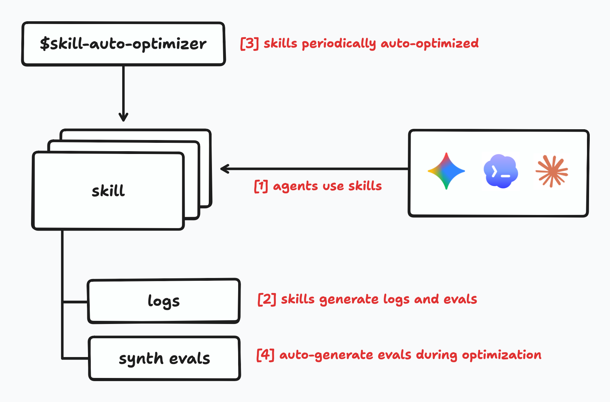

# skill-auto-optimizer



Ask your coding agent to install this skill from GitHub:

```text
Install the `skill-auto-optimizer/` directory from https://github.com/dikarel/skill-auto-optimizer/tree/main/skill-auto-optimizer with your agent's preferred skill-install flow, then restart the agent so the new skill is loaded.
```

One generic manual option:

```bash
git clone https://github.com/dikarel/skill-auto-optimizer.git
cp -R skill-auto-optimizer/skill-auto-optimizer /path/to/your/agent/skills/
```

Restart your agent after installation so the new skill is picked up.

## What This Skill Is

`skill-auto-optimizer` is a meta-skill for reviewing and improving other local filesystem agent skills.

It is intended to:
- inspect installed skills, skipping hidden or system-managed skill directories by default
- ensure each skill emits both performance and quality metrics during usage
- look at recent per-skill logs
- propose targeted optimizations to `SKILL.md`, scripts, references, agent metadata, and new helper files
- stay read-only until a human explicitly approves edits for that specific skill
- stay read-only for tests, benchmarks, and script execution until a human explicitly approves those runs for that specific skill

The optimizer works per skill, not as a global batch approval flow.

## Repo Layout

- `skill-auto-optimizer/SKILL.md`: primary skill instructions
- `skill-auto-optimizer/perf_optimization/`: performance metric and objective specs
- `skill-auto-optimizer/quality_optimization/`: quality metric and objective specs
- `SKILLS_TEST_SUITE.md`: intentionally flawed sample-skill fixtures for evaluation
- `TEST.md`: iterative evaluation plan and graphing workflow

## Contributor Structure Guide

For contributors and coding agents, the repo is split into two layers:

- repo support files at the root
- the installable skill under `skill-auto-optimizer/`

How to think about each area:
- `README.md`: contributor-facing overview, install instructions, and repo map
- `skill-auto-optimizer/`: the actual shipped skill directory that gets installed into an agent's skills folder
- `skill-auto-optimizer/SKILL.md`: the runtime entrypoint; keep this concise and use it to point to deeper docs rather than stuffing everything into one file
- `skill-auto-optimizer/perf_optimization/`: performance-specific standards and optimization objectives
- `skill-auto-optimizer/quality_optimization/`: quality-specific standards and optimization objectives
- `SKILLS_TEST_SUITE.md`: defines the sample broken skills used to evaluate optimizer behavior
- `TEST.md`: explains how to run repeated optimization passes and graph improvement over time

## Results

| Fixture | perf baseline | perf opt | Δperf | qual baseline | qual opt | Δqual |
|---|---|---|---|---|---|---|
| chatty-reference-loader | 62.76 | 109.90 | +47 | 40.05 | 25.79 | −14 |
| serial-scriptless | 53.42 | 78.18 | +25 | 11.61 | 17.29 | +6 |
| missing-metrics | 76.12 | 77.96 | +2 | 46.67 | 44.91 | −2 |
| quality-regression-trap | 47.00 | 35.62 | −11 | 34.92 | 25.56 | −9 |
| travel-planning | 51.59 | 48.74 | −3 | 12.62 | 12.46 | −0 |
| **Aggregate mean** | **58.18** | **70.08** | **+12** | **29.17** | **25.20** | **−4** |

