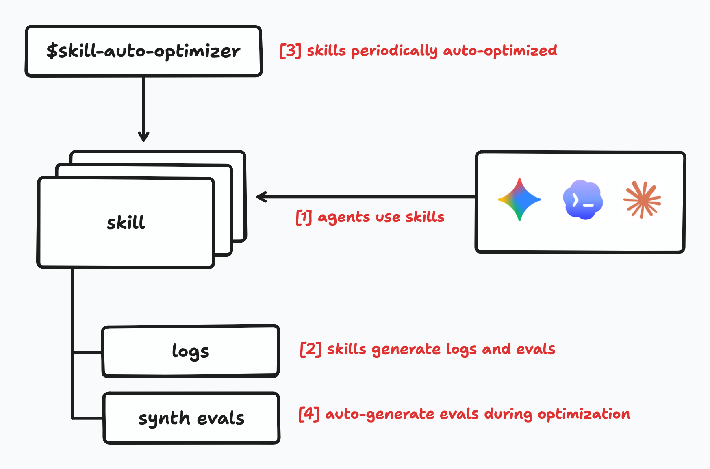

# skill-auto-optimizer



Ask your coding agent to install this skill from GitHub:

```text
Install the `skill-auto-optimizer/` directory from https://github.com/dikarel/skill-auto-optimizer/tree/main/skill-auto-optimizer with your agent's preferred skill-install flow, then restart the agent so the new skill is loaded.
```

One generic manual option:

```bash
git clone https://github.com/dikarel/skill-auto-optimizer.git
cp -R skill-auto-optimizer/skill-auto-optimizer /path/to/your/agent/skills/
```

Restart your agent after installation so the new skill is picked up.

## What This Skill Is

`skill-auto-optimizer` is a meta-skill for reviewing and improving other local filesystem agent skills.

It is intended to:
- inspect installed skills, skipping hidden or system-managed skill directories by default
- ensure each skill emits both performance and quality metrics during usage
- look at recent per-skill logs
- propose targeted optimizations to `SKILL.md`, scripts, references, agent metadata, and new helper files
- stay read-only until a human explicitly approves edits for that specific skill
- stay read-only for tests, benchmarks, and script execution until a human explicitly approves those runs for that specific skill

The optimizer works per skill, not as a global batch approval flow.

## Repo Layout

- `skill-auto-optimizer/SKILL.md`: primary skill instructions
- `skill-auto-optimizer/perf_optimization/`: performance metric and objective specs
- `skill-auto-optimizer/quality_optimization/`: quality metric and objective specs
- `eval_harness/`: the evaluation harness (real tool-execution loop, live tool-use and grounding metrics, multi-sample confidence intervals)
- `fixtures/`: the four intentionally flawed baseline skills and their backing data
- `SKILLS_TEST_SUITE.md`: definitions of the fixture suite
- `TEST.md`: how to run the evaluation

## Contributor Structure Guide

For contributors and coding agents, the repo is split into two layers:

- repo support files at the root
- the installable skill under `skill-auto-optimizer/`

How to think about each area:
- `README.md`: contributor-facing overview, install instructions, and repo map
- `skill-auto-optimizer/`: the actual shipped skill directory that gets installed into an agent's skills folder
- `skill-auto-optimizer/SKILL.md`: the runtime entrypoint; keep this concise and use it to point to deeper docs rather than stuffing everything into one file
- `skill-auto-optimizer/perf_optimization/`: performance-specific standards and optimization objectives
- `skill-auto-optimizer/quality_optimization/`: quality-specific standards and optimization objectives
- `eval_harness/`: the harness that evaluates the fixtures (see `eval_harness/README.md`)
- `fixtures/`: the four flawed baseline skills and their backing data
- `SKILLS_TEST_SUITE.md`: defines the sample broken skills used to evaluate optimizer behavior
- `TEST.md`: explains how to run the evaluation

## Results

Four fixtures, N = 8 samples per variant, `claude-sonnet-5` as agent, judge, and
optimizer. Values are means; perf is the harness perf score, quality is the 0-100
composite. Reproduce with `python eval_harness/run.py --samples 8`.

| Fixture | perf baseline | perf opt | quality baseline | quality opt |
|---|---|---|---|---|
| chatty-reference-loader | 93.8 | 149.6 | 86.2 | 90.4 |
| serial-scriptless | 21.2 | 76.0 | 79.0 | 79.4 |
| missing-metrics | 168.4 | 131.7 | 57.9 | 50.5 |
| quality-regression-trap | 218.6 | 89.5 | 37.6 | 86.5 |
| **Aggregate mean** | **125.5** | **111.7** | **65.2** | **76.7** |

Under symmetric measurement, optimization improves quality (mean +18%) without
trading it for efficiency. Aggregate efficiency declines modestly (-11%): that drop is
dominated by the cost of the retrieval that grounding requires (quality-regression-trap
does more tool work to answer correctly), plus one over-optimization regression on
missing-metrics that the per-skill human approval gate is designed to catch.

